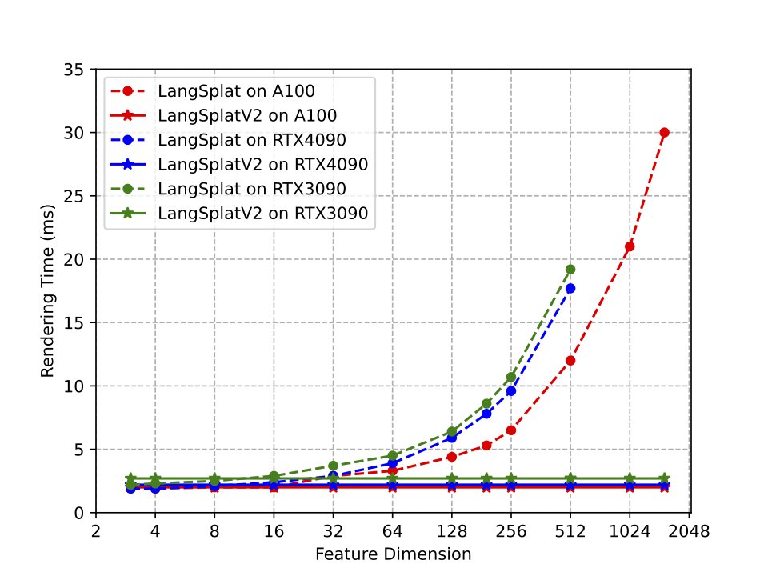
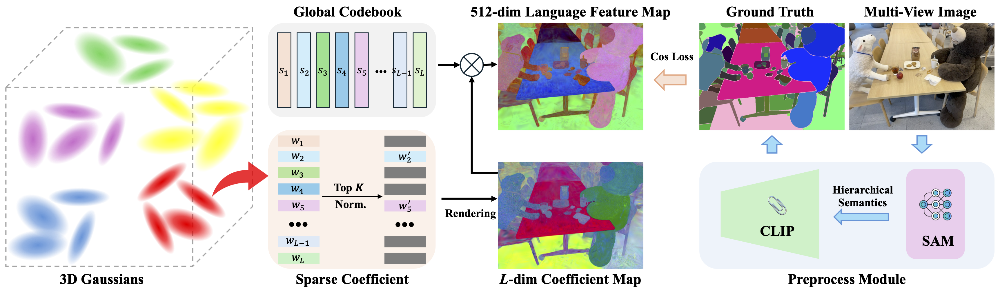

# LangSplatV2: High-dimensional 3D Language Gaussian Splatting with 450+ FPS
<div align="center">
  <p>
    <a href="https://li-wanhua.github.io/">Wanhua Li*</a>,
    <a href="https://github.com/ZhaoYujie2002">Yujie Zhao*</a>,
    <a href="https://minghanqin.github.io/">Minghan Qin*</a>,
    <a href="https://github.com/jimmyYliu">Yang Liu</a>,
    <a href="https://caiyuanhao1998.github.io/">Yuanhao Cai</a>,
    <a href="https://people.csail.mit.edu/ganchuang/">Chuang Gan</a>,
    <a href="https://vcg.seas.harvard.edu/people">Hanspeter Pfister</a>,
  </p>
</div>
<div align="center">
  (* indicates equal contribution)
</div>

<!--
[Wanhua Li*](https://li-wanhua.github.io/), [Yujie Zhao*](https://github.com/ZhaoYujie2002), [Minghan Qin*](https://minghanqin.github.io/),  [Yang Liu](https://github.com/jimmyYliu), [Yuanhao Cai](https://caiyuanhao1998.github.io/), [Chuang Gan](https://people.csail.mit.edu/ganchuang/), [Hanspeter Pfister](https://vcg.seas.harvard.edu/people/hanspeter-pfister)<br>(\* indicates equal contribution)<br>
-->

<div align="center">
<!--
<a href="https://jytime.github.io/data/VGGT_CVPR25.pdf" target="_blank" rel="noopener noreferrer">
  
</a>
-->
<a href="https://arxiv.org/abs/2507.07136">
  
</a>
<a href="https://langsplat-v2.github.io/">
  
</a>
<a href="https://drive.google.com/drive/folders/1qcBxcjtgsKq7a5rJUkLxB85usBKB8B4g?usp=sharing">
  
</a>
</div>
<!--
| [Webpage](https://langsplat.github.io/) | [Full Paper](https://arxiv.org/pdf/2312.16084.pdf) | [Video](https://www.youtube.com/watch?v=XMlyjsei-Es) |<br>
| Preprocessed Dataset | [BaiduWangpan](https://pan.baidu.com/s/1S_cdmN9EFOlCQ3z1GZR3EA?pwd=lfea) | [GoogleDrive](https://drive.google.com/drive/folders/1Icw5AcQkY_2L_k7ddXrGCJ3z4laa4jg5?usp=sharing) |<br>
| Pre-trained Models | [BaiduWangpan](https://pan.baidu.com/s/12L83uEi5KlF9ViAZqp0B4w?pwd=dl22) | [GoogleDrive](https://drive.google.com/drive/folders/1ASFXWOwaXP_aSXV2iMDmEfILaDXQXlrE?usp=sharing) |<br>
| [Datasets](https://drive.google.com/file/d/1QF1Po5p5DwTjFHu6tnTeYs_G0egMVmHt/view?usp=sharing) |<br>
-->

<p align="center">
    
</p>



This repository contains the official authors implementation associated with the paper "High-dimensional 3D Language Gaussian Splatting with 450+ FPS". We further provide the datasets and model weights. 

## Clone the Repository

The repository contains submodules, thus please check it out with 
```shell
# SSH
git clone git@github.com:ZhaoYujie2002/LangSplatV2.git --recursive
```
or
```shell
# HTTPS
git clone https://github.com/ZhaoYujie2002/LangSplatV2.git --recursive
```

## Setup
#### Requirements
- Conda (recommended for easy setup)
- C++ Compiler for PyTorch extensions (we used VS Code)
- CUDA SDK 11 for PyTorch extensions (we used 11.8)
- C++ Compiler and CUDA SDK must be compatible
- A NVIDIA A100 GPU (we used in our experiments)

#### Environment Setup

Our default, provided install method is based on Conda package and environment management:
```shell
conda env create --file environment.yml
conda activate langsplat_v2
```

## Prepare Dataset
In the experiments section of our paper, we primarily utilized Three datasets: the LERF dataset and the 3D-OVS dataset and the Mip-NeRF360 dataset.

The LERF dataset is accessible for download from repository [LangSplat](https://github.com/minghanqin/LangSplat?tab=readme-ov-file) via the following link: [Download LERF Dataset](https://drive.google.com/file/d/1QF1Po5p5DwTjFHu6tnTeYs_G0egMVmHt/view?usp=sharing).

The 3D-OVS dataset is accessible for download from repository [3D-OVS](https://github.com/Kunhao-Liu/3D-OVS) via the following link: [Download 3D-OVS Dataset](https://drive.google.com/drive/folders/1kdV14Gu5nZX6WOPbccG7t7obP_aXkOuC?usp=sharing).

The Mip-NeRF360 dataset is accessible for download from repostory [GAGS](https://github.com/WHU-USI3DV/GAGS?tab=readme-ov-file) via the following link: [Download Mip-NeRF360 Dataset](https://drive.google.com/drive/folders/1_IbWgVgvnCy4jq9P5EcE6xS44ftcmtgq).

For your own scenes, you need to acquire the following dataset format and a pre-trained RGB model follow the [3D Gaussian Splatting](https://github.com/graphdeco-inria/gaussian-splatting) repository.
```
<dataset_name>
|---images
|   |---<image 0>
|   |---<image 1>
|   |---...
|---output
|   |---<dataset_name>
|   |   |---point_cloud/iteration_30000/point_cloud.ply
|   |   |---cameras.json
|   |   |---cfg_args
|   |   |---chkpnt30000.pth
|   |   |---input.ply
|---sparse
    |---0
        |---cameras.bin
        |---images.bin
        |---points3D.bin
```

## QuickStart

Download the pretrained model to ```output/```, then simply use

```shell
# For the LERF dataset
# eg. bash eval_lerf.sh teatime 0 10000
bash eval_lerf.sh $scene_name $model_idx $checkpoint
```

## Pipeline

The pipeline for training LangSplat V2 and evaluation.
- **Step 1: Generate Language Feature of the Scenes.**
  ```shell
  python preprocess.py --dataset_path $dataset_path 
  ```
- **Step 2: Train the Global Semantic Codebook and the Sparse Coefficient Field.**
  ```shell
  bash train.sh $dataset_root_path $scene_name $model_idx
  ```
- **Step 3: Eval.**

  For the LERF dataset
  ```shell
  bash eval_lerf.sh $scene_name $model_idx $checkpoint
  ```

## TODO list:
- [x] update the arxiv link
- [ ] release more model weights
- [ ] release more code of evaluation


<section class="section" id="BibTeX">
  <div class="container is-max-desktop content">
    <h2 class="title">BibTeX</h2>
    <pre><code>@misc{li2025langsplatv2highdimensional3dlanguage,
      title={LangSplatV2: High-dimensional 3D Language Gaussian Splatting with 450+ FPS}, 
      author={Wanhua Li and Yujie Zhao and Minghan Qin and Yang Liu and Yuanhao Cai and Chuang Gan and Hanspeter Pfister},
      year={2025},
      eprint={2507.07136},
      archivePrefix={arXiv},
      primaryClass={cs.GR},
      url={https://arxiv.org/abs/2507.07136}, 
}</code></pre>
  </div>
</section>

